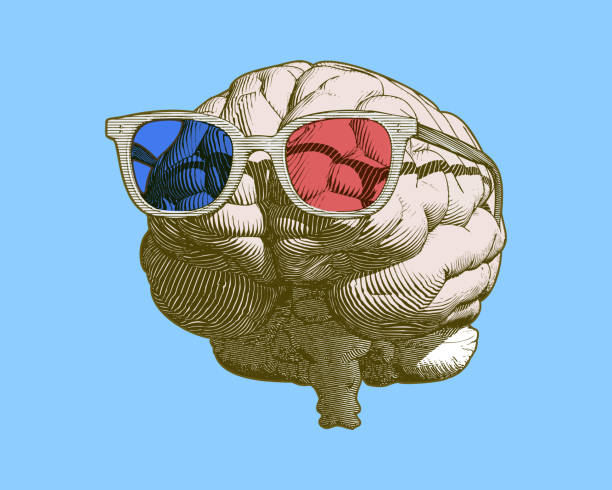
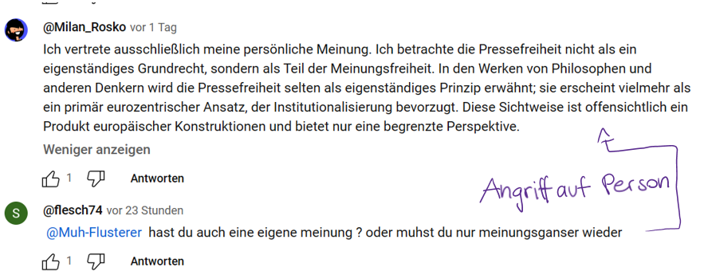
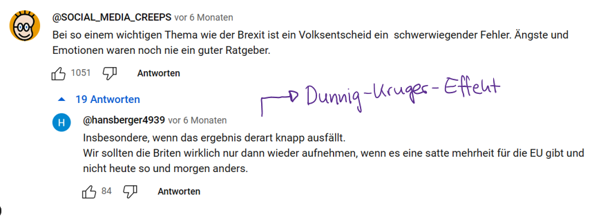
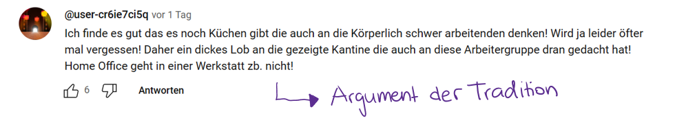

+++
title = "Kritisches Denken"
date = "2024-04-21"
draft = false
pinned = false
tags = ["Kritisches", "Denken", "Deutsch"]
image = "istockphoto-1173726696-612x612.jpg"
+++

Im Verlauf dieses Quartales haben wir – die M25c – im Deutschunterricht das kritische Denken vertieft angeschaut. Wieso brauchen wir kritisches Denken? Wann ist eine Situation geeignet, kritisch zu denken? Und was ist überhaupt kritisches Denken?

### Kritisches Denken:

Das kritische Denken ist ein aktiver Prozess mit dem Ziel, durch reflektiertes Nachdenken und Prüfen von Aussagen zu einer Wahrheit zu kommen. Gemeint ist hier Wahrheit im Sinne von Wissen, das aus gut gerechtfertigten, wahren Überzeugungen besteht. Um zu dieser Wahrheit zu gelangen, muss eine Person sich nicht nur mit den Meinungen anderer kritisch auseinandersetzen, sondern auch mit ihrem eigenen Denkverhalten. Denn auch bei sich selbst, können Fehler während des Denkprozesses entstanden sein. Kritisch zu denken, ist jedoch nicht alles immer kritisch zu hinterfragen, sondern bei wichtigen Themen wie Politik kognitive Verzerrungen wie auch logische Fehlschlüsse zu erkennen und bei uns selbst zu vermeiden. 

Bei den logischen Fehlschlüssen kann zwischen formalen und informalen Fehlschlüssen unterschieden werden.

Formale Fehlschlüsse betreffen die logische Struktur des Argumentes. Dies bedeutet, dass die Schlussfolgerung nicht aus den Prämissen hergeleitet werden kann. Eine Prämisse ist eine Annahme oder eine Voraussetzung, auf der eine Argumentation basiert (z.B.: Im April kann es schneien). 

Beispiel: (Annahme: nasse Strasse wegen Regen) Wenn es regnet, dann ist die Strasse nass. Die Strasse ist nass, also hat es geregnet. 

In diesem Fall ist keine Prämisse falsch. Wenn es regnet, dann wird die Strasse höchstwahrscheinlich nass. Und in dem Beispiel ist die Strasse nass, weil es geregnet hat. Jedoch könnte die Strasse auch aus einem anderen Grund nass sein. So kann nicht geschlussfolgert werden, dass es geregnet haben muss. 

Informale Fehlschlüsse betreffen die inhaltliche Qualität der Prämissen. Dies bedeutet, eine oder mehrere Prämissen sind inkorrekt, die Schlussfolgerung kann jedoch aus den Prämissen gezogen werden.

Beispiel: Alle Menschen lieben Brokkoli. Peter ist ein Mensch, also liebt er Brokkoli.

Wichtige informale Fehlschlüsse: 

*Angriff auf die Person:* Eine Eigenschaft der Person wird angegriffen, nicht deren Argument.

*Argument der Beliebtheit:* Wenn etwas beliebt ist, ist es gültig, sprich richtig.

*Strohmann-Argument*: Eine verzerrte Version des Argumentes wird angegriffen.

Kognitive Verzerrungen sind Denkmuster, die die Sicht auf die Realität verzerren. Sie entstehen, da die Menschen annehmen, dass alles stimmt, was unser Gehirn aus den teils im Unterbewusstsein aufgenommen und verarbeitet hat. 

*Bestätigungsfehler*: Die neue Information wird so verarbeitet, dass sie unsere bestehende Erwartung erfüllt.

*Dunning-Kruger-Effekt*: Person mit wenig Kompetenz auf einem Gebiet überschätzen diese. Personen mit höheren Kompetenzen unterschätzen sich.

### Kritisches Denken in dem Digitalen Zeitalter

Ein Ort, bei dem sich kritisches Denken lohnt, ist Social Media. Allein auf YouTube werden stündlich 500 Stunden Videomaterial hochgeladen. Darunter befinden sich Musikvideos, Schmink-Tutorials, Vlogs und etliche Recherchebeiträge – manche gut, andere weniger gut recherchiert. Die Videos werden einem dank dem Algorithmus für den User nach seinem Interesse vorgeschlagen. Durch dieses spezifische Aussuchen bewegt sich der User nur in seiner Bubble und wird weiter in seinem Glauben sowie seiner Meinung bestätigt. Doch mit Abstand das grösste Problem ist, dass alle die Möglichkeit haben, ihren "Senf" hinzuzufügen und die meisten dies noch tun. Dafür muss die Person nicht einmal selbst ein Video hochladen, sondern kann in den Kommentaren ihr Halbwissen preisgeben. Das führt zu tonnenweisen logischen Fehlschlüssen und kognitive Verzerrungen, wie an folgenden Bespielen zu sehen ist: 

### Quellenangabe:

YouTube Statistiken: 10 spannende Fakten für das Jahr 2023 (oberlo.de)

Skript „Kritisches Denken“