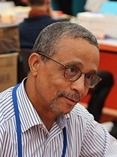

+++
title = "L’Attentat"
date = "2024-01-09"
draft = false
pinned = false
image = "l-attentat.jpg"
+++
## **L'auteur**

* Yasmina Khadra – nom real : Mohammed Moulessehoul
* Né à Kenadsa, une ville d’Algérie
* A fait beaucoup d’expérience de guerre horrible dans la militaire
* Craque à la censure de littérature de l’armée, il a publié multiples livres avec des pseudonymes différents 
* Aujourd’hui il vit à la France et a publié plus que 35 romans

## **Le résumé :**

Le livre s'agit d'une chirurgie qui s'habite à Tel Aviv, en israélise. Au début livre la femme du chirurgien Amin s'exploser dans un café. Après ça le chirurgien est très triste et il recherche pourquoi sa femme fait l'attentat. Il apprend beaucoup des choses qu'il ne veut pas apprendre et il devient dépressif. En cours de ce livre on apprend beaucoup du conflit de Israël et Palestine. On apprend pourquoi il' y a des personnes qui commets des attentats et on apprend pourquoi c’est difficile de résoudre ce conflit.

## **Les thèmes de ce livre :**

Ce livre joue dans Israël. Israël a des problèmes avec terrorisme. Ce livre présenter ces problèmes des deux côtes ; Israël et Palestine. Les deux parties ont des problèmes avec violence et discrimination. Les deux côtes qui sont responsable pour les conflits en Israël, fait de violence contre les habitants innocent. L'Auteur veut faire attention de la violence entre les deux parties, qui tue des personnes innocente et la discrimination qui existe à cause de ce conflit. 

## **Une petite Analyse :**

Les thèmes du livre sont :

* Le conflit entre Israël et Palestine – un thème très actuel. 
* Processus de deuil quand une personne importante est morte. 
* La discrimination

Ce livre est écrit de la perspective d’Amine. Donc on a une vue subjective et on ne sait pas, si les choses qui ont passé sont vrai. Additionnel, le livre nous monte jusque le côté de la personne Palestine. 

## **Notre opinion :**

Nous pensons que le livre est très intéressante, parce-que on apprend beaucoup sur le conflit dans Israël et les problèmes qui existe parce-que ce conflit. C’est un bon livre pour les personnes qui sont intéressé par politique et histoire.