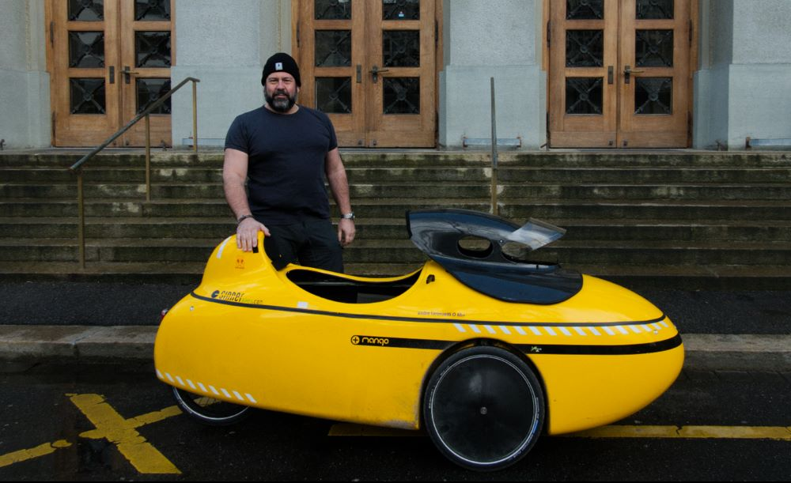

+++
title = "Volles Programm, Vollgas und dann Hängematte: André Lorenzetti"
date = "2023-06-11"
draft = false
pinned = true
tags = ["Deutsch", "Reportage"]
+++


Am Gymnasium Kirchenfeld kennen ihn alle: André Lorenzetti, den Rektor der Schule. Jede\*r Schüler\*in sieht ihn ab und zu auf den Gängen und grüsst ihn freundlich. Aber wer ist der Mann eigentlich, der die Geschicke des Gymnasiums Kirchenfeld leitet? Ein Team von 3 Reporter*innen hat André Lorenzetti durch einen Arbeitstag begleitet



Es ist 5.45 Uhr in Oberdiessbach, als André Lorenzettis Wecker klingelt. Da der Rektor des Gymnasiums Kirchenfeld ca. 25 Kilometer von Bern entfernt wohnt, hat er einen ziemlich langen Arbeitsweg. Damit der Sport nicht zu kurz kommt, fährt er 45 Minuten mit seinem eleganten Liegevelo zum Gymnasium Kirchenfeld. Lorenzetti ist jeweils einer der ersten, die im Schulhaus sind. Wenn er im Büro ankommt, liegt bereits ein Berg Pendenzen auf dem Schreibtisch, den er heute abarbeiten sollte. Der Rektor hat aber nur begrenzt Zeit, denn seine Assistentin hat bereits viele Termine für den Tag eingeplant. Um in eine gute Arbeitsstimmung zu kommen, spielt Lorenzetti gerne Musik ab. Er kann aber zum Arbeiten nur Musik hören, die er kennt und bei denen er nicht auf die Lyrics achtet. Zuerst ordnet Lorenzetti alle Pendenzen und erstellt dann einen Zeitplan, um die Lücken zwischen den Terminen effektiv nutzen zu können. Diesen Zeitplan inklusive Pausen hält er sehr genau ein, nach der einberechneten Zeit müssen die Pendenzen jeweils abgearbeitet sein. Er könne, wie wohl alle Menschen, die Dinge noch besser machen, aber die Zeit, die ihm zur Verfügung stehe, bestimme die Qualität seiner Arbeit, meint Lorenzetti

Als die Schulglocken erstmals läuten, beginnt die Rektoratssitzung (mit Alicia Salas, der Assistentin der Schulleitung, und Jacqueline Weber, seiner persönlichen Assistentin). Die Sitzung dient dem Austausch und Klären von anstehenden Fragen. «Wir befürchten stets, in der Aufgaben- und Terminflut etwas zu verpassen», meint Lorenzetti. Deshalb bemühe sich die Schulleitung stets um ein gutes Pendenzen- und Projektmanagement. Der Rektor ist viel beschäftigt und gefragt, der Kalender ist dementsprechend eng getaktet und Freiraum muss effizient genutzt werden. Ein Traktandum der heutigen Sitzung ist die Lohnmaschine, die Fehler in der Lohnauszahlung aufzeigt. Diese Fehler muss jemand beheben. Zudem muss Lorenzetti sich dringend mit einem disziplinarischen Fall auseinandersetzen. Es ist ihm daher wichtig, dass das reguläre Tagesgeschäft auch ohne ihn glatt läuft, damit ihm ausreichend Zeit für die Sonderfälle bleibt. Dafür bedarf es den wöchentlichen Rektoratssitzungen.

<!--EndFragment-->