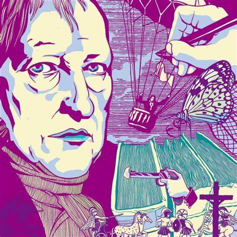
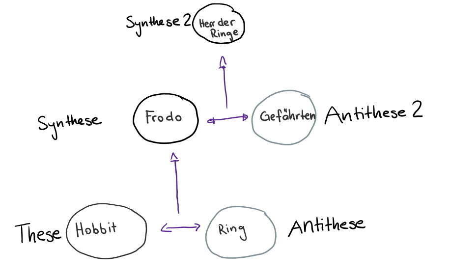

+++
title = "Deutscher Idealismus und Klimaschutz"
date = "2024-04-21"
draft = false
pinned = false
tags = ["Idealismus", "Deutsch"]
image = "hegel.jpeg"
+++

In den letzten Wochen lasen wir das von Büchner verfasste Fragment Woyzeck, das zur Zeit des Frührealismus geschrieben wurde. Unser Ziel war, das Fragment werkübergreifend zu analysieren. Deshalb befassten wir uns mit der Zeitepoche, in der Woyzeck geschrieben wurde: dem Frührealismus. Um den Frührealismus richtig zu verstehen, mussten wir uns mit dem deutschen Idealismus auseinandersetzen, der von Philosophen geprägt wurde.  Die Philosophen waren der Meinung, dass das Denken und die Vernunft massgebend sind, um die Wirklichkeit – also unsere Umwelt/ unser Sein – zu verstehen. 

### Hegels Ideologie

Eine führende Person für den deutschen Idealismus war Georg Wilhelm Friedrich Hegel. Hegel sprach von einer Weltvernunft als den universellen Geist, sprich Vernunft, die die Entwicklung der Weltgeschichte lenkt. Für Hegel bestimmt die Weltvernunft, warum die Welt so organisiert ist– also so ist, wie sie ist – und gewisse Ereignisse in der Weltgeschichte geschehen mussten. Denn nur so kann der ideale Zustand erreicht werden. Die Weltvernunft hat Hegel dort gesehen, wo die Macht vorzufinden ist. 

Die Weltvernunft entwickelt sich fortschreitend und dialektisch. Dialektisch ist in dem Sinn zu verstehen, dass etwas Unvollkommenes (These) auf ein anderes unvollkommenes Einzelnes (Antithese) trifft und in der Auseinandersetzung zu etwas Neuem (Synthese) wird. Diese Synthese kann im Verlauf der Zeit als These wieder auf eine Antithese treffen und sich so fortlaufend weiterentwickeln. 

Wissen ist daher nach Hegels Verständnis etwas Dynamisches, sich stetig Entwickelndes. Dadurch ist alles Wissen relativ.

Für Hegel trat der ideale Zustand im preussischen Staat ein, doch noch heute finden sich Vertreter seiner Philosophie. 

### Klimaschutz und Hegel

Ein Ort, an dem Hegels dialektischer Ansatz deutlich noch heutzutage sichtbar ist, ist der Klimaschutz.

Auf der einen Seite (These) steht die dringende Notwendigkeit des Umweltschutzes und der Reduzierung der Treibhausgasemission. Denn ohne die Umwelt zu schützen, kann der Idealzustand von einer langen gut belebbaren Erde nicht erreicht werden. Die Antithese ist der Wunsch nach wirtschaftlichem Wachstum und einem hohen Lebensstandard. Einfach Mal in den Ferien in die USA zu fliegen, sich noch ein viertes Paar neue Jeans zu kaufen. Doch um das Ideal zu erreichen, muss ein Mittelweg zwischen These und Antithese gefunden werden. Die Synthese ist also eine umweltfreundlichere Wirtschaftsweise, die sowohl ökologische Nachhaltigkeit berücksichtigt als auch wirtschaftliche Entwicklung zulässt. Und für den privaten CO2-Verbrauch, halt Mal in ein Brockenhaus einkaufen gehen und mit dem Zug verreissen.  Auch wie bei Hegel ist die Lösung eine Balance zwischen scheinbar widersprüchlichen Positionen. 

Wie bei Hegel wird die Weltvernunft – hier: das Anpacken dieses Problems – an den Ort der Macht platziert. Im Falle des Klimaschutzes ist es nicht der preussische Staat, sondern das Parlament zusammen mit dem Bundesrat, die den Klimaschutz vorantreiben sollen – die Synthese finden sollen. Das Parlament soll Gesetze erlassen, die dem CO2-Austrieb Grenzen setzen und das Ausbauen von Siedlungen im Zaum halten sollen. Dass das Individuum von sich aus nachhaltiger leben würde, ist ja zu idealistisch. 

Ein weiter Aspekt des deutschen Philosophen, der heute noch gilt: Wissen ist relativ und entwickelt sich stetig. Wir können nicht wissen, was die beste, sinnvollste und einfachste Lösung für die Umwelt zu schützen ist. Wir müssen einfach Mal anfangen und schauen, was funktioniert und was nicht hilfreich ist. Unser Wissen wird sich weiterentwickeln, sinnvollere Massnahmen können getroffen werden und das Wichtigste: immer mehr Menschen werden über das Knowhow zum nachhaltigen Leben verfügen und hoffentlich versuchen, dieses Wissen auf ihr Leben anzuwenden. Denn nur getrieben von der idealen Vorstellung – unseren Planeten retten zu können – werden genügend Menschen überzeugt sein, etwas an ihrem Verhalten zu ändern. 

Hegels Idealismus ist daher nicht eine alte Vorstellungsweise, die längst schon abgeschrieben wurde, sondern immer noch in unserem heutigen Alltag und Herangehensweisen vorzufinden



Ich habe diesen Text mit Hilfe der KI ChatGPT und dem Skript « Der deutsche Idealismus» verfasst. ChatGPT hat mir geholfen, meine Ideen zu strukturieren und auszufeilen. Den Text habe ich selbst geschrieben, aber gelegentlich den Chat für mögliche Formulierungen gefragt. Die Informationen habe ich aus dem ausgeteilten Skript sowie einer Onlineseite (Quellenangabe). Durch das Schreiben dieses Textes habe ich mich noch einmal mit dem Idealismus auseinandergesetzt und bin mir über die Komplexität des Themas bewusst geworden. Ich habe aber das Gefühl, mit Hilfe des Schreibens das Chaos ein bisschen geglättet zu haben. 



##### Quellen:

Philosophie für Zwischendurch: Die Welt ist Geist | quell-online.de (quellonline.de), Deutsch Skirpt